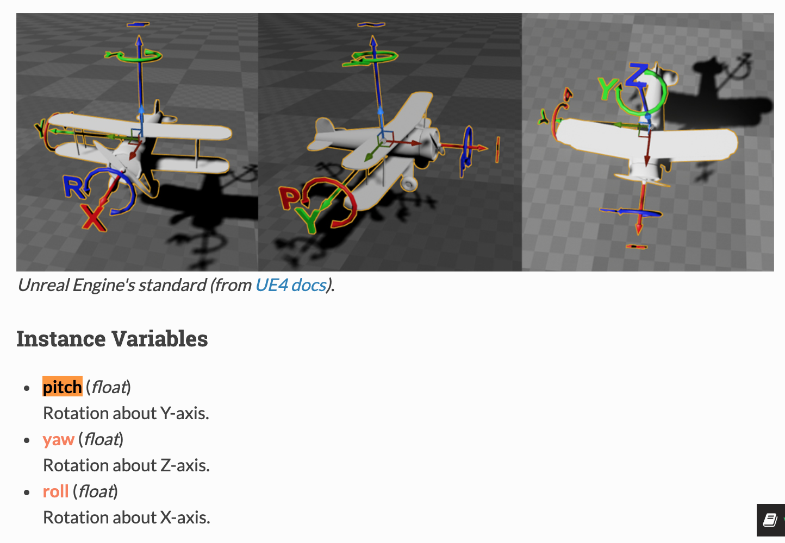

# Carla Resourse
[carla Demo Link](https://github.com/tyGavinZJU/carla_py) ps:(Thanks for IamWangYunKai)

## Usage

    python run.py

## Carla Full Data (Include RGB Vision)
百度云链接: https://pan.baidu.com/s/1Mw3e51XvHYBkBQ6yacQ97Q 提取码: ksq1 复制这段内容后打开百度网盘手机App，操作更方便哦

## Data Structure in output

Take VehicleInfo_output0 as an example

|帧数|x坐标|y坐标|z坐标|pitch|yaw|roll|油门|车轮左右方向|刹车|手刹|是否倒车档|是否手动挡|前进档位|
|---|---|---|---|---|---|---|---|---|---|---|---|---|---|
| 3798 | 67.78395080566406 |	7.88435173034668 |0.06765922158956528	|0.03830369934439659	|0.8613703846931458	|0.10297129303216934|	1.0	|-0.3305932581424713|	0.0	|False|	False|	False|	0|

- rotation detail

- 油门 (float)
A scalar value to control the vehicle throttle [0.0, 1.0].
- 轮子方向 (float)
A scalar value to control the vehicle steering [-1.0, 1.0].
- 刹车 (float)
A scalar value to control the vehicle brake [0.0, 1.0].
