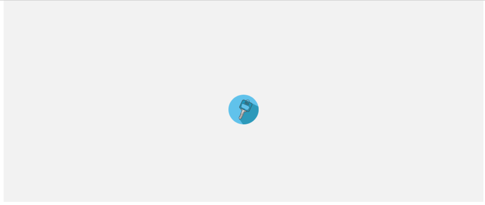
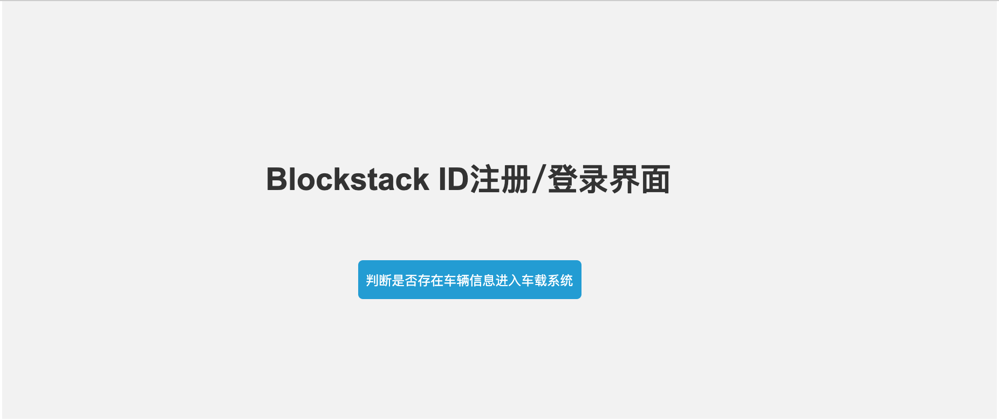
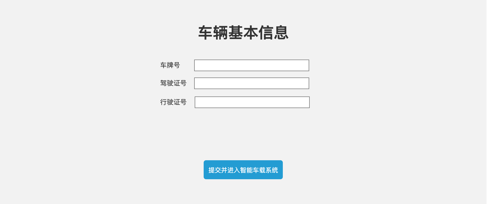
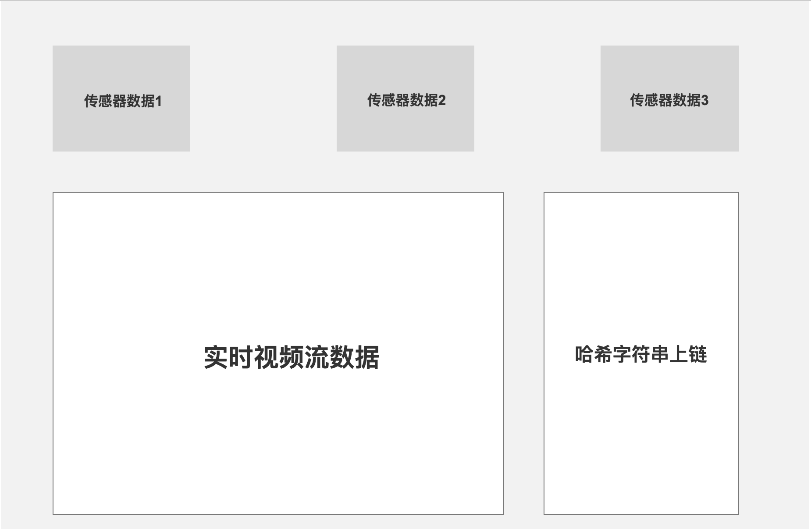

# WanXiangHackathon
WanXiangHackathon ShangHai 19.9.15~19.9.16

## Info
[区块链周](http://www.blockchainlabs.org/week2019/index_cn.html)

[万向黑客松](http://www.blockchainlabs.org/week2019/hackathon_cn.html)

## RoadMap

- 智能汽车的身份（CID）
- 智能汽车的隐私存储系统（Gaia） + 权限分配
- 智能汽车的数据存证（上链）
- 智能汽车的数据价值流通（众包）
- 智能汽车的数据交换（链端隐私存储系统授权）

### Another Version

1.车智能体，车有自己的数字身份，**车联网**，CID，**数据隐私**

2.车拥有自己产生的数据，控制数据的权限

3.数据市场，价值流动，给权限

4.智能汽车区块链层面的数据交换，P2P

5.**数据存证，每隔一段时间存一帧的哈希**

#### 用户视角的流程(前端界面)

1. 进入主界面，中心显示一个酷炫的车钥匙  -- BING
2. 点击车钥匙，进入Blockstack ID -- BING -- 根据Blockstack ID查询信息，没有则直接进入车辆基本信息填写界面，否则直接进入4
3. 表格，填写车辆的基本信息 -- 
4. **界面弹回** --> 根据Blockstack ID哈希生成一个非人类可读的字符串(10-15位) -- BING，进入智能车载系统

