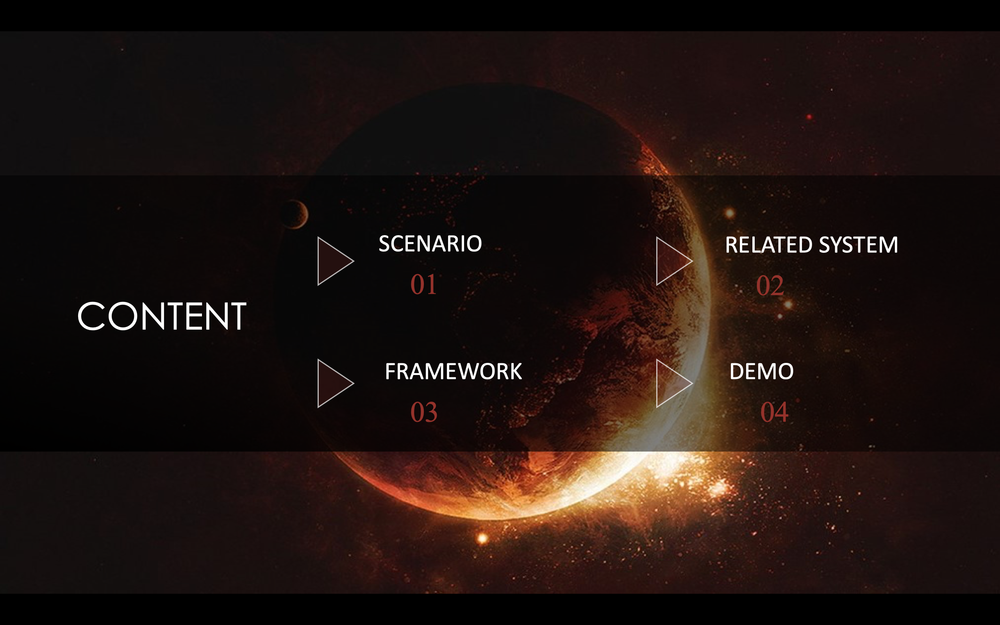
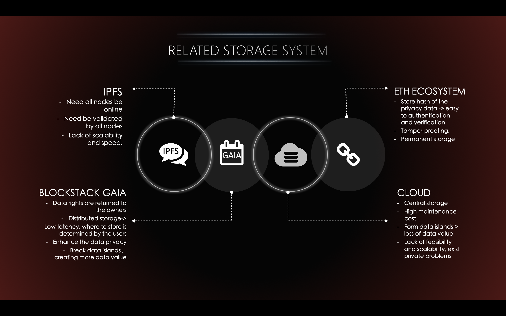
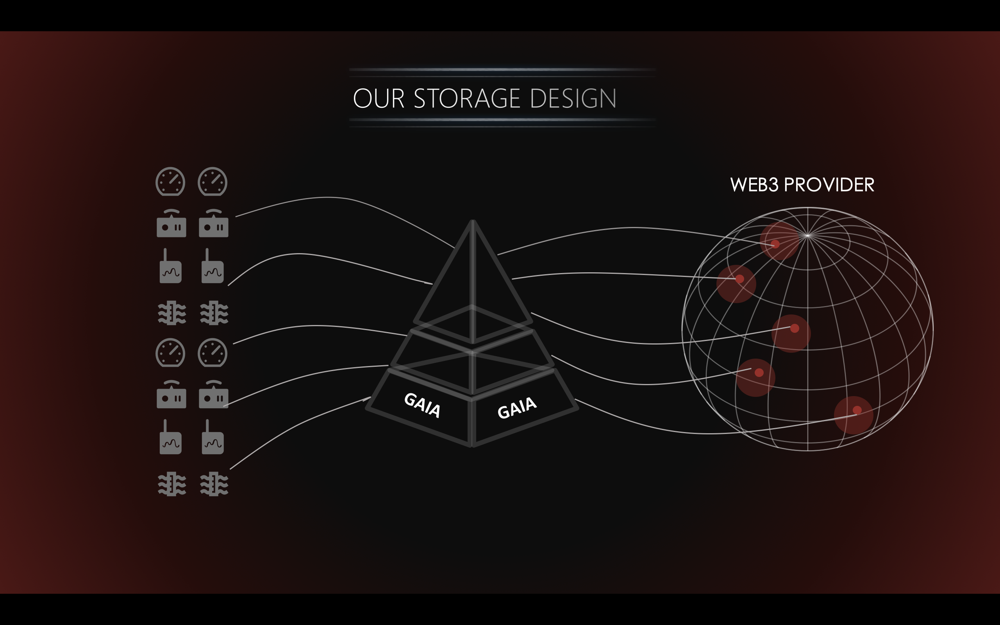
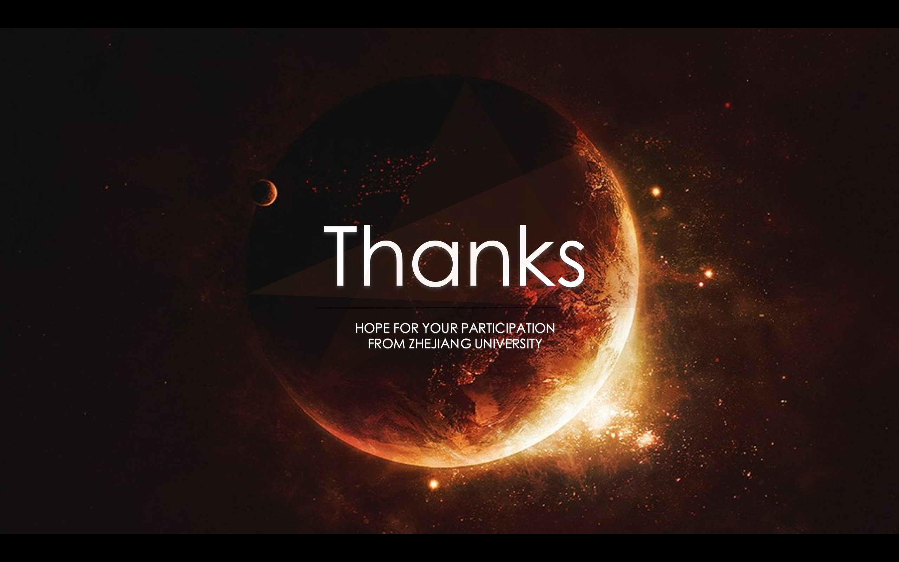

# Gaia-Provider(web3) 

> A simple Vue.js project using Gaia&web3 provider built for the decentralized web.

## Introduction

> IOT System using Gaia & web3-provider. Presentation of Wanxianghackthon in Shanghai 19/9/15


> Content



> Current framework's disadvantages: 
> 1.Data Islet 2.Data Privacy 3.Data Verifying 4.efficiency&cost 


> Recent popular framework of storage  
> Cloud : Lack of Data Privacy & Data Verifying   
> IPFS : Good at storing something about copyright like music & article copyright.   
> EVM : Good at data computation & tamper-proof. Low Data Storage Efficiency.  
> Gaia : Good at storing big file | Data which is not suitable for winding on chain  





## Build Setup

``` bash
# install dependencies
npm install | yarn install

# Compiles and hot-reloads for development
npm run serve | yarn run serve

# Compiles and minifies for production
npm run build | yarn run build
```
## Linting & Unit test

``` bash
# Lints and fixes files
npm run lint

# Run your unit tests
npm run test:unit
```

